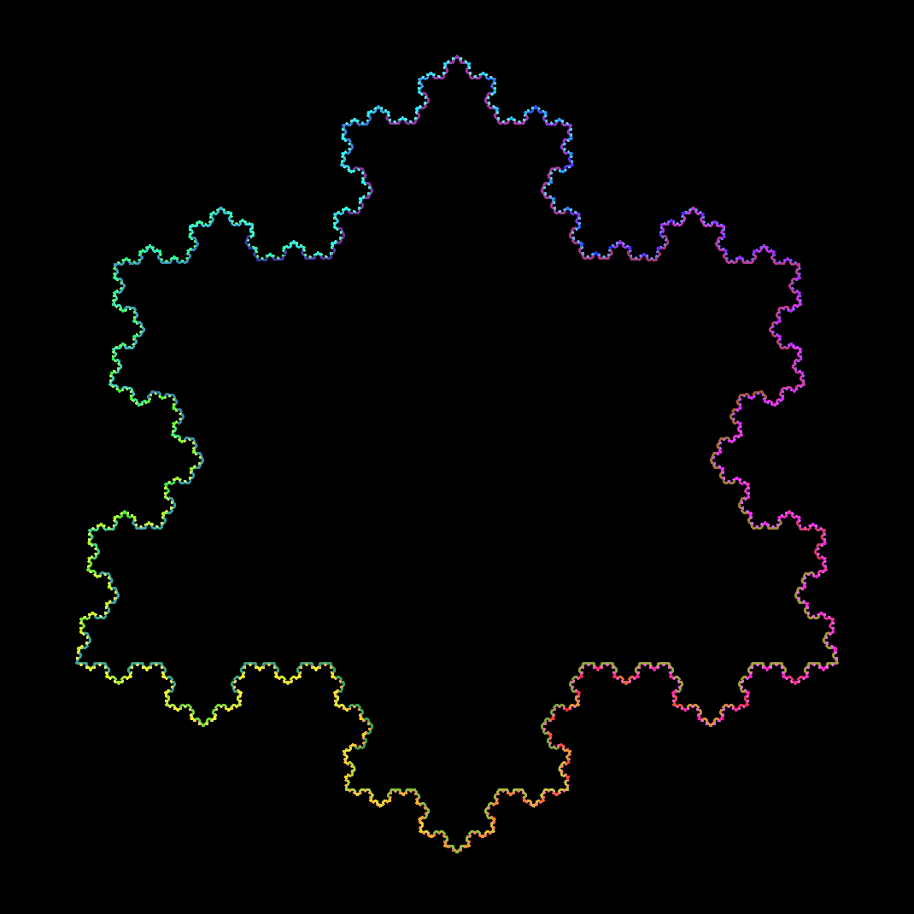

# Fractals
### Rendered using [wgpu](https://wgpu.rs/) (Rust implementation of the [WebGPU](https://www.w3.org/TR/webgpu/) API)

<table>
  <tr>
    <td></th>
    <td></th>
    <td></th>
  </tr>
  <tr>
    <td><a href="https://en.wikipedia.org/wiki/Fractal_canopy">Canopy</a></td>
    <td><a href="https://en.wikipedia.org/wiki/Sierpi%C5%84ski_triangle">Sierpinski triangle</a></td>
    <td><a href="https://en.wikipedia.org/wiki/Koch_snowflake">Koch snowflake</a></td>
  </tr>
  <tr>
    <td>13th iteration, 0.2π left angle, 0.35π right angle</td>
    <td>7th iteration</td>
    <td>6th iteration</td>
  </tr>
</table>

### Controls

- `SPACE`: Start/stop animation
- `←`/`→`: Cycle through different fractals
- `↑`/`↓`: Increase/decrease fractal iteration
  - ⚠️ Careful: Memory usage increases exponentially with every iteration increase. When you eventually run out of memory, your operating system will (hopefully) attempt to prevent itself from crashing by killing this process.
- Only when viewing [Canopy](https://en.wikipedia.org/wiki/Fractal_canopy):
  - `F`/`D`: Increase/decrease left angle
  - `J`/`K`: Increase/decrease right angle

# Installation

## Download and run a prebuilt binary...

...from the [latest release](https://github.com/julius-boettger/fractals/releases/latest) (if available for your platform)

## Build and run from source

### Using [Nix Flakes](https://wiki.nixos.org/wiki/Flakes)
```sh
# option 1: fully automatic
nix run github:julius-boettger/fractals
# option 2: fetch source, build, run
git clone https://github.com/julius-boettger/fractals
cd fractals
nix build
./result/bin/fractals
```

### Using [Cargo](https://doc.rust-lang.org/cargo/getting-started/installation.html)
```sh
# fetch the source
git clone https://github.com/julius-boettger/fractals
cd fractals
# build
cargo build --release
# run
./target/release/fractals[.exe]
```
