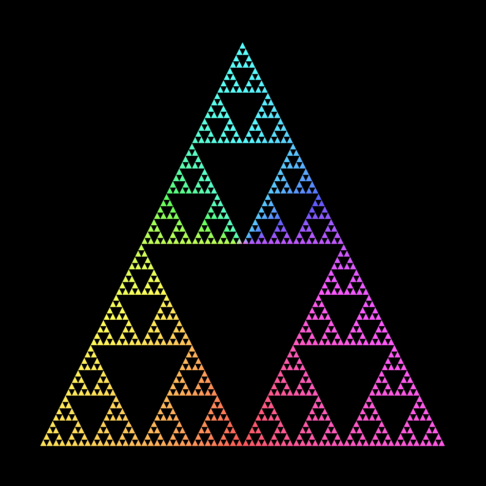

# Fractals
### Rendered using [wgpu](https://wgpu.rs/) (Rust implementation of the [WebGPU](https://www.w3.org/TR/webgpu/) API)

<p align="middle">
   
   
  <br>
  5th iteration of <a href="https://en.wikipedia.org/wiki/Koch_snowflake">Koch snowflake</a> (left) and <a href="https://en.wikipedia.org/wiki/Sierpi%C5%84ski_triangle">Sierpinski triangle</a> (right)
</p>

## Controls

- `←`/`→`: Cycle through different fractals
- `↑`/`↓`: Increase/decrease fractal iteration
  - ⚠️ Careful: Memory usage increases exponentially with every iteration increase. When you eventually run out of memory, your operating system will (hopefully) attempt to prevent itself from crashing by killing this process.

## Run it yourself

Using [Nix Flakes](https://nixos.wiki/wiki/flakes) (probably only works on Wayland):
```sh
nix run github:julius-boettger/fractals
```

Using [Cargo](https://doc.rust-lang.org/cargo/getting-started/installation.html):
```sh
git clone https://github.com/julius-boettger/fractals
cd fractals
cargo run
```
